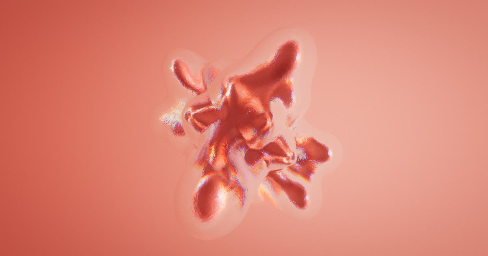

# Bumpy Metaballs 2026

Metaballs with a bumpy skin, rebuilt from the 2013 original: an isosurface
polygonised on the GPU every frame, normal-mapped without UVs, and shaded as
anything from wet flesh to frosted glass.

**[Try it in your browser](https://spite.github.io/bumpy-metaballs-2026/)**



## What it is

A field of moving blobs and other shapes, turned into a
mesh and rendered with one of fifty material presets. The blobs drift, orbit or
follow the original 2013 motion; the shapes run from spheres and boxes to knots,
a gyroid, a Goursat tangle and Suzanne. Glass presets draw a second, inner
surface — a core — seen through a refracting, absorbing shell.

It is a from-scratch rewrite of _Bumpy Metaballs_ on three.js and WebGL2. The
2013 version polygonised on the CPU and shaded with a matcap; this one does the
whole field on the GPU and lights it from an environment map.

## How to use it

Drag to rotate, scroll to zoom. The keyboard does the rest:

| key             |                           |
| --------------- | ------------------------- |
| Space           | pause                     |
| R               | random material and scene |
| ← →             | previous and next preset  |
| F, double-click | fullscreen                |
| Tab             | hide the interface        |

The panel holds everything else:

- **Scene**: resolution, blobs and their motion, the shape and its
  size, thickness, height, width, angle and rounding (only the ones that shape
  uses are shown), twists along each axis, and the backdrop and environment.
  With **Twist** turned up, moving the cursor over the surface swirls it.
- **Outside** and **Inside**: the shell and core materials, normal maps and
  glass settings.
- **Occlusion**: strength, reach and tint of the ambient occlusion and
  shadows.
- **Post**: bloom, chromatic aberration, vignette, grain, tone mapping and
  FXAA.
- **Debug**: shading terms, wireframe, the intermediate buffers, and GPU
  timings for each pass.

The address bar always holds the whole look, so copying the URL shares exactly
what is on screen. Picking a preset changes the material and leaves the shape
settings alone.

`?size=1080` renders a fixed 1080×1080 canvas whatever the window, for
screenshots and recordings, and `window.app` exposes the sketch to the console.

## How it works

**The field.** Each frame the scalar field is evaluated into a 3D float texture,
one draw per slice. Blobs are a sum of inverse-square falloffs; shapes are
signed distance functions added into the same field, so they melt into the
blobs. Every shape is sized as the surface you see rather than the core it is
measured from, and scaled down if it would leave the volume.

**Polygonising.** Marching cubes runs in a vertex shader. A first pass writes
each voxel's case and vertex count into a texture, which is reduced into a
histopyramid; each vertex then walks down the pyramid to find its voxel and
edge, so only as many vertices are drawn as the surface has. The count comes
back from the GPU asynchronously, a few frames late, with some headroom.

**Surface.** Normals come from the field's gradient. The bumps are triplanar
normal maps, since a marching-cubes mesh has no UVs. Lighting is image based,
from a prefiltered HDR environment.

**Glass.** The shell draws its far wall and then its near wall, each refracting
a copy of what is behind it, with per-channel dispersion, blur and absorption
by thickness. The core is a second isosurface of the same field at a higher
level, drawn opaque underneath.

**Occlusion and shadows.** Ambient occlusion is screen space, at half
resolution. Shadows are traced through the field texture rather than the depth
buffer, so parts of the surface hidden behind others still cast shadows.

**Post.** Bloom, chromatic aberration, vignette, ACES tone mapping, grain and
FXAA, in one grade pass plus the antialiasing.

There is no build step: the page loads ES modules directly through an import
map, with three.js and the other dependencies vendored in `third_party/`. To
run it locally, serve the folder:

```
python3 -m http.server
```

## License

MIT, see [LICENSE](LICENSE).
